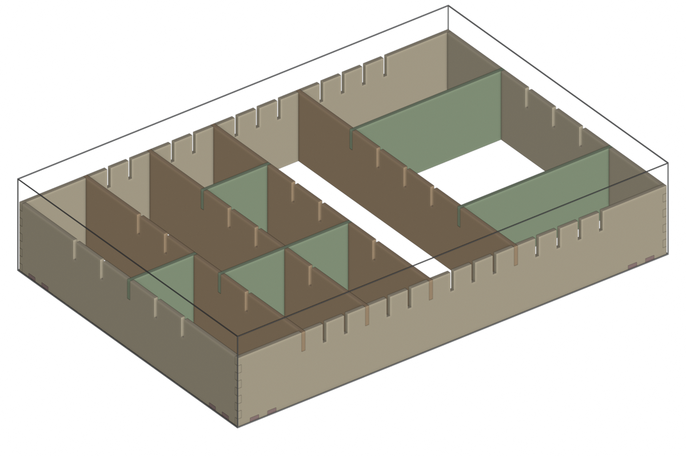
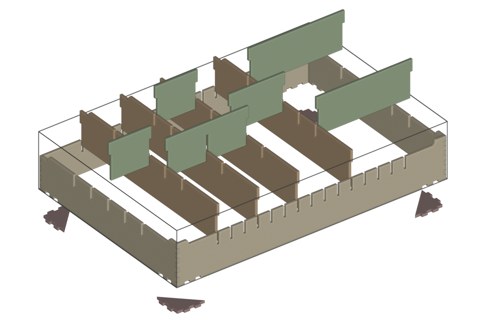
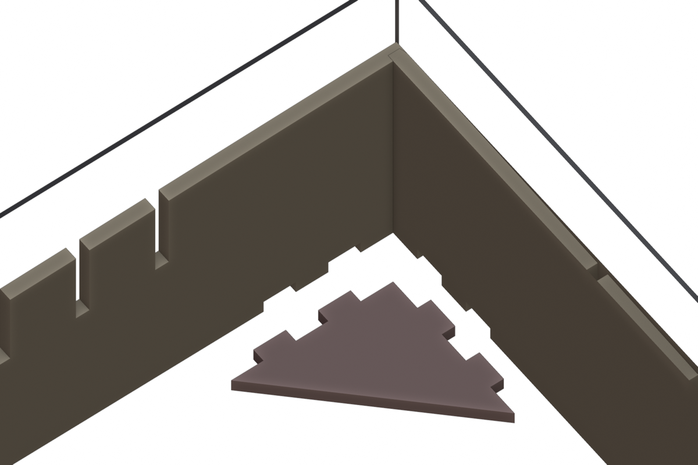
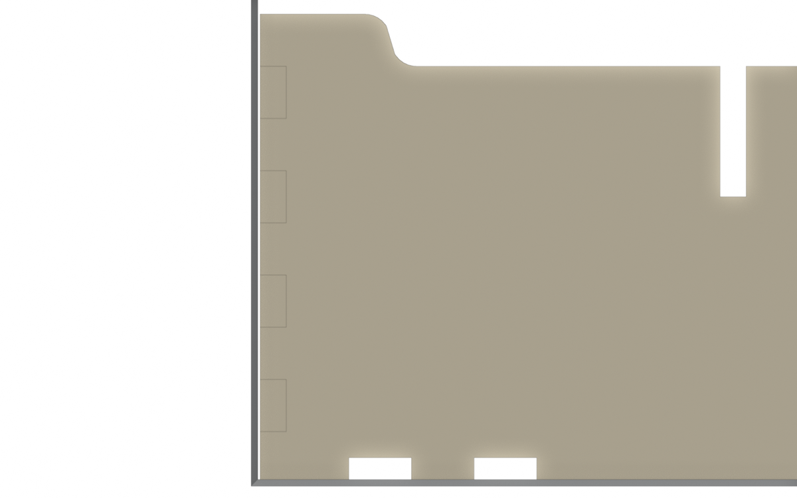
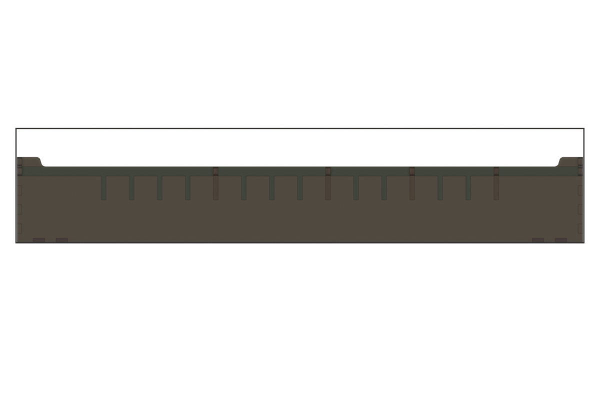

# Kitchen drawer organizer

A floorless, finger-jointed plywood box that fits a kitchen drawer, with a grid of
drop-in dividers. Column dividers split the drawer left to right; row dividers split
any column front to back. The box is glued; the dividers just drop in, so the layout
can change later.

## The drawer

| | inches |
|---|---|
| interior width | 29.75 |
| interior depth | 20.25 |
| interior height | about 6 |

## How it goes together

- **Walls.** Four walls joined at the corners with finger joints. The long walls have
  fingers at the top and bottom corners; the short walls have the matching notches.
- **Notch grid.** Every wall has notches cut down from its top edge at a fixed pitch,
  symmetric about the middle of the wall. The front and back walls' notches are where
  column dividers can go; the side walls' notches are where row dividers can go.
- **Column dividers** run front to back. Each end has a notch cut up from the bottom
  edge that straddles the wall, while the remaining top part of the end drops into the
  wall's notch, passing right through the wall and ending flush with its outer face.
  This egg-crate joint holds the divider against sideways and front-to-back movement.
  Column dividers carry the same top-edge notch grid as the side walls.
- **Row dividers** run left to right and drop onto the side walls and column dividers
  with the same joint. A row divider can span several columns; it then crosses the
  column dividers in between with a bottom notch at each crossing.
- **Raised front corners, dropped back edge.** The front wall stands at full height
  from each corner, then eases down half an inch over a 2 in run to the interior
  level, finishing half an inch before the first slot, and runs flat at that level
  across the slotted region. The side walls do the same at their front ends. The S is two quarter
  circles of quarter-inch radius, convex then concave, so it leaves one level and
  arrives on the other smoothly. The back edge of the whole box sits half an inch
  below the interior level: the back wall is flat at that height for its full
  length, and the side walls and column dividers ease down to it the same way, starting
  half an inch past the last row slot, so everything behind the last row position sits
  at the back level. Row dividers are flat at the interior level.
  Every divider ear is flush with the edge it passes through, front and back. The
  shoulder is a cubic ease, level at both ends and about 21 degrees at its steepest,
  which is also exactly one Bezier curve in a cut file.
- **Corner gussets.** A flat right-angle triangle lies on the drawer floor in each
  corner, its two legs against the walls. Two tabs along each leg pass through the wall
  and end flush with its outer face, which sits against the drawer. The walls have
  matching notches up from their bottom edges. Glued in, the gussets keep the box
  square and hold it square during glue-up. Without glue they add nothing: the walls
  can lift straight off the tabs.

Assembly order: glue the walls and gussets together (the gussets set the corners
square), then drop in column dividers, then row dividers. To reconfigure, lift the row
dividers out and move things around.

## Parameters

All in `config.py`, all in inches.

| parameter | default | notes |
|---|---|---|
| `clearance` | 1/16 per side | box is the drawer size minus twice this |
| `height` | 4.5 | wall height at the raised corners |
| `thickness` | 5.2 mm (0.2047 in) | measured with calipers, 5.1 to 5.2 mm; set to the thick reading so slots fit everywhere |
| `column_steps` | 18 | grid steps across the width; must be even, and a multiple of any number of equal columns you want |
| `row_steps` | 8 | grid steps along the depth; must be even |
| `notch_depth` | 1.25 | how far a divider's ear engages its slot, measured from the interior level |
| `corner_rise` | 0.5 | how much higher the front corners stand than the interior level; 0 for straight tops |
| `back_level` | 3.5 | height of the whole back edge; leave unset for raised back corners like the front |
| `step_gap` | 0.5 | flat edge kept between any step and the nearest slot; the raised and lowered bands run from the corners to there |
| `corner_plateau_min` | 1.5 | least full-height edge kept at a corner; slot positions that would shorten it are dropped |
| `corner_curve` | `ease` | shoulder shape: `ease` (cubic S over `step_run`), `ogee` (two quarter circles, vertical in the middle) or `round` (one quarter circle) |
| `step_run` | 2.0 | length of an `ease` shoulder; circular shoulders are as long as the step is tall |
| `finger_width` | 0.5 | target; the real width makes an odd finger count |
| `edge_margin` | 0.5 | solid wood kept between the outermost notch and a corner joint |
| `gusset_leg` | 3.0 | leg length of the corner gussets; 0 removes them |
| `gusset_tabs` | 2 | tabs along each gusset leg |
| `columns` | per layout | grid indices of column dividers, 0 at the centre |
| `rows` | per layout | `(start boundary, end boundary, row index)` |

Grid indices count outward from the middle: column index 0 is the drawer's centre line,
negative is left, positive is right; row index 0 is the middle of the depth, negative
toward the front. Grid positions that would run into a gusset, or leave less than the minimum corner
plateau, are dropped, so with the defaults there are 13 column positions and 5 row
positions.

**Slot depths.** The interior level is `height - corner_rise` (4.0). Slot floors sit
`notch_depth` below the local top, so every ear engages its slot by 1.25 in: floors at
2.75 in the front and side walls and in the column dividers, and at 2.25 in the back
wall, whose top is lower. A column divider's bottom notches match: 2.75 in tall at the
front, 2.25 at the back, which gives it a definite front and back.

**Grid steps.** The wall length minus one stock thickness is divided into an even
number of equal steps: 18 across (a pitch of 1.634 in) and 8 front to back (2.490 in).
A cell against a wall is bounded by one wall face and one divider face, a cell between
dividers by two divider faces; with an even step count those come out the same width
for the same number of steps, so any cell is simply steps x pitch minus thickness,
wherever it sits. Splitting the drawer into m equal columns needs the step count to be
a multiple of m: 18 allows 2, 3, 6 or 9 equal columns.

## Layouts

`config.py` holds the box parameters once and a set of named layouts on top of them;
`build.py --layout NAME` builds one, and `build.py` prints the cell sizes.

**three-plus-two** (the default): three equal columns of 3 steps on the left, then a
4-step and a 5-step column.

| column | clear width | cells front to back |
|---|---|---|
| 1 | 4.699 | 9.755 / 9.755 |
| 2 | 4.699 | 7.265 / 12.245 |
| 3 | 4.699 | 7.265 / 7.265 / 4.775 |
| 4 | 6.333 | 9.755 / 9.755 |
| 5 | 7.968 | 4.775 / 9.755 / 4.775 |

**six-equal**: six columns of 3 steps, each 4.699 in wide, with the two outer columns
split in half.

The row dividers in both are demonstration sets; their lengths follow the columns
automatically.

## Cutting

| part | count | size (in) | on the Glowforge |
|---|---|---|---|
| front wall | 1 | 29.625 x 4.5 | passthrough |
| back wall | 1 | 29.625 x 3.5 | passthrough |
| side wall | 2 | 20.125 x 4.5 | passthrough |
| column divider | 4 | 20.125 x 4.0 | passthrough |
| row dividers | 6 | 5.11 to 10.01 x 4.0 | fit on the bed |
| corner gusset | 4 | 3.20 x 3.20 | fit on the bed |

Every part that runs the full depth of the drawer is just over the 19.5 in bed, so the
walls and column dividers all need the passthrough. Shrinking the box to 19.5 in deep
would avoid that for everything except the two long walls, at the cost of about 3/4 in
of slop front to back.

### Cut files

    uv run python projects/drawer-organizer/cutfiles.py --layout three-plus-two

nests every part onto the stock described in `config.STOCK`, pre-cut 48 x 19 in
sheets fed long side first through the passthrough, and writes one SVG per sheet
(`out/cut/three-plus-two-sheet1.svg`, `-sheet2.svg`), plus `kerf-coupon.svg` and a
nesting report. Parts stay at least 0.55 in from the long edges and 1 in from each
end, and the packed band is centred across the width so the leftover splits evenly
side to side, leaving 0.83 in clear on both sides of sheet 1. Neither a slightly
out-of-square sheet nor a little drift in the passthrough can clip a part. Each SVG is the size of the sheet in real inches, one closed path per
part, cut strokes black, so it drops into the Glowforge app or Illustrator at true
scale. Ease shoulders are true Bezier curves. The parts need two sheets; the second
is packed from one end so the rest is a clean offcut. Different stock:
`--sheet-width`, `--sheet-length` (0 for one sheet of any length, up to 20 in wide),
`--edge-margin`, `--end-margin`.

| sheet | parts | across | along | offcut |
|---|---|---|---|---|
| 1 | front wall, both side walls, three column dividers, five row dividers, two gussets | 0.83 to 18.17 in | 1.00 to 46.55 in | 1.45 in at the far end |
| 2 | back wall, one column divider, one row divider, two gussets | 1.42 to 17.58 in | 1.00 to 30.64 in | 17.37 x 19 in |

Parts are not centred along the length: keeping them at one end leaves the rest of
the sheet as a single usable offcut rather than two short pieces.

**Kerf.** Every part is offset outward by half the kerf before writing, so slots come
off the laser a stock thickness wide and ears a stock thickness thick. The kerf was
calibrated with the coupon on this plywood: 0.010 in, recorded in `config.STOCK` and
used by default. To recalibrate (new material, new laser), cut `kerf-coupon.svg`: it
has three slots made for kerf settings 0.004 below, at, and 0.004 above the current
value, marked with one, two and three score ticks. Whichever slot takes a scrap of
the same stock with the friction you want names the kerf to pass with `--kerf`, and
a fit between two slots means the value between them. Set `thickness` in the config
to the measured stock before cutting the coupon, since the slots are made for it.

**Passthrough.** The walls and column dividers are longer than the 11 in bed, so the
sheet goes through the passthrough slot and the Glowforge app steps it through in
sections. Parts are nested as rectangles; no two are closer than 0.1 in.

## Decisions and open questions

1. **Wall height 4.5 in** in a drawer about 6 in tall, leaving generous clearance above.
2. **Notch depth 1.25 in.** Shallow top-edge notches keep the wall tops mostly clean;
   the dividers' 2.75 in bottom notches do the holding. The trade-off is that a divider
   is held sideways only by its 1.25 in ear in the wall slot, so a loose fit lets it
   rock; kerf compensation at export should aim for a snug fit.
3. **18 steps across, 8 front to back.** An earlier grid used 20 steps across, which
   cannot split evenly into six columns; 18 supports both the three-plus-two layout and
   six equal columns at a slightly coarser 1.63 in pitch. 24 steps would support six
   equal columns too at a finer pitch, with more slots in the walls.
4. **Corner gussets, 3 in legs.** They triangulate the corners of a box that otherwise
   has nothing keeping it square once it leaves the drawer. The cost is a triangle of
   floor in each corner cell and the divider positions nearest the corners, which only
   ever made cells under 2.5 in wide. A 2 in leg keeps one more column position per
   side. The box is glued, so they earn their keep.
5. **Stock thickness.** Measured 5.1 to 5.2 mm across the sheets; the design uses
   5.2 mm so slots and finger notches fit the thick spots, and the thin spots get at
   most 0.1 mm of play. The kerf coupon's slots step by 0.1 mm, which brackets that.
6. **Bands set by the slots.** The raised front bands and the lowered back band each
   run from the corner to a shoulder that finishes half an inch short of the nearest
   slot, so the flat interior level spans exactly the slotted region. With the 2 in
   ease, the full-height plateau is about 1.9 in on the front wall and 2.5 in on the
   side walls, and the flat part of the lowered back band about 2.5 in. The back of
   the box sits at 3.5 in, an inch below the front corners.
7. **Cubic ease over 2 in.** A first version used an S of two quarter circles, which
   is vertical at its midpoint and reads as a rounded step. The cubic ease spreads the
   half-inch change over 2 in at about 21 degrees; longer runs eat the corner plateau.
   The circular styles remain available. The back wall's slot
   floors drop by the same half inch so the column dividers' back ears keep the full
   1.25 in of engagement.
8. **Raised corners instead of waves.** An earlier version gave every panel a random
   undulating top. Because a wall's height then differed at each slot, divider ears had
   to be recessed to stay interchangeable, and the panels stopped being identical parts.
   Raised corners with a flat interior keep a shaped top edge while restoring flush
   ears, uniform slots, and identical dividers. The wave generator remains in the
   shared library for other projects.
9. **Grain and faces.** Plywood cuts the same either side up, and the walls' outer faces
   sit against the drawer, so only the top edges and the divider faces show.

## Files

- `design.py` – turns an `OrganizerConfig` into panels with 3D placements, and
  reports the cut list and cell sizes.
- `config.py` – this drawer's numbers and the current layout.
- `build.py` – builds the Blender scene, saves a `.blend`, renders previews.
- `cutfiles.py` – nests every part onto a sheet and writes the SVG cut files and a
  kerf test coupon.
- `test_design.py` – checks the grid, the cut list, the config validation, and that no
  two panels occupy the same space at any joint.
- `renders/` – previews from the current config.
